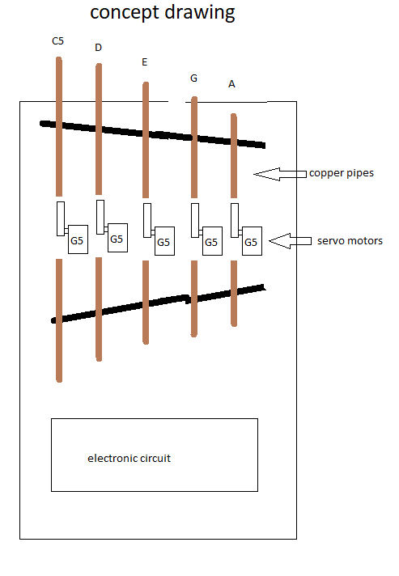

# tubular-door-bell
sonnette d'entrée constituée de 5 tubes de cuivre avec des pic-bois sculpté utilisés comme marteaux.  Les tubes sont coupés pour former une gamme pentatonique.

## dessin de conception

