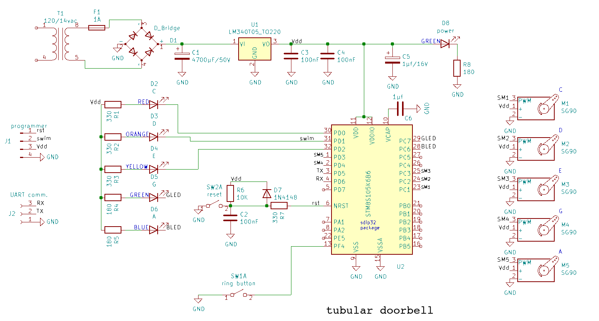

# tubular-door-bell
sonnette d'entrée constituée de 5 tubes de cuivre avec des pic-bois sculpté utilisés comme marteaux.  Les tubes sont coupés pour former une gamme pentatonique.

## dessin de conception

## Ressources utiles

* Site de Lee Hite sur les [tubular wind chime](http://leehite.org/Chimes.htm)

#### 2020-09-03

Modification au circuit pour ajouter une LED pour chaque note. 

#### 2020-09-02

Ajout du schéma électronique

#### 2020-08-31

J'ai complété la coupe des tuyaux de cuivre. J'ai utilisé le [fichier excell](docs/DIY_Millimeters_Wind_Chime_Tube_Calculator_A=440_Pentatonic_Scale.ods) trouvé sur le site de Lee Hite pour le calcul de la longueur. Pourtant les fréquences sont trop hautes. Hier j'avais utilisé une méthode empirique pour découvrir la longueur des tuyaux et j'obtenais pour une longueur de 37cm la fréquence 520 Hertz, soit très près du DO 5.  Le calculateur de Lee Hite me donne une longueur de 35,5cm pour ce tuyau et c'est trop court. Non seulement la fréquence du **DO 5** est trop haute ce qui ne serait pas si grave si les rapports de fréquence étaient juste entre les tuyaux mais ils ne le sont pas, j'entends un battement pour certaines combinaisons d'accords. J'aurais du garder ma formule déduite par expérimentation et qui me donnait des rapports justes. La formule que j'utilisais était la suivante:

**L2=L1*sqrt(f1/f2)**

* L2  longueur désirée pour la note suivante
* L1  longueur du tuyau pour la note DO5 qui était 37cm
* f1  fréquence du DO 5 soit 523,3 Hertz
* f2  fréquence de la note supérieur désirée 
* sqrt() et la racine carré

J'obtenais les valeurs suivantes:

note | fréquence | longueur tube (cm)
-|-|-
DO5|523,3 | 37
RÉ|587,3 | 34,9
MI|659,3 | 33
SOL|784 | 30,2
LA |880 | 28,5

Ceci est pour les tubes de cuivre 1/2" qu'on retrouve dans les quincalleries en Amérique du nord. le diamètre externe est de 16mm et l'interne environ 13,8mm. 

Tanpis je vais faire avec ces tuyaux même si l'accord n'est pas tout à fait juste. 

J'ai commencé à sculpter les martaux pic-bois. Il me reste à les sabler à et à les peindre. 

Demain je vais commencer la conception du circuit électronique.

