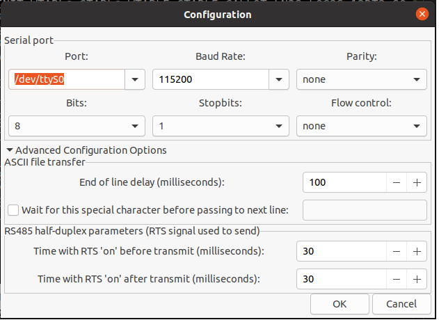

# tubular-door-bell
sonnette d'entrée constituée de 5 tubes de cuivre avec des pic-bois sculpté utilisés comme marteaux.  Les tubes sont coupés pour former une gamme pentatonique.

## dessin de conception


## Ressources utiles

* Site de Lee Hite sur les [tubular wind chime](http://leehite.org/Chimes.htm)


## programmation du MCU

* Allez dans le dossier stm8_eforth et faire la commande 
```
make -f door-bell.mk eforth
```
Maintenant stm8 eForth est programmé dans le MCU. Il faut un émulateur de terminal. Je travaille en Ubuntu 20.04 LTS et j'utilise GTKTerm comme émulateur de terminal. Sur mon PC le port utilisé pour communiqué avec le MCU via le UART2 est **/dev/ttyS0**. Voici la configuration du port dans GTKTerm. **NOTE:** la version du programmeur **STLINK** est indiquée dans le fichier **door-bell.mk**.
<br><br>
. 
<br><br>

### Modificiation à la procédure

* Le transfert via GTKTerm du fichier source vers le MCU ne fonctionne pas correctement. GTKTerm s'arrête après avoir transmit 4096 octets. J'ai donc du créer un petit utilitaire de ligne de commande pour faire le transfert de l'application **doorbell.f** la procédure est la suivante. 
```
tubular-door-bell>cd SendFile
SendFile>./SendFile -s /dev/ttyS0 ../doorbell.f
port=/dev/ttyS0, baud=115200,delay=100 file=../doorbell.f
Sending file ../doorbell.f
168 lines sent
SendFile>

```

* L'application forth **doorbell.f** doit maintenant être programmée dans le MCU. Ça se fait par le transfert du fichier **doorbell.f**.<br>**Attention** j'ai édité ce fichier dans **geany** avec des fin de lignes **CR/LF** pour que le transfert s'effectue correctement. Le transfert se fait avec la commande SendFile.

* Une fois l'application compilée en mémoire flash il faut dans le terminal eForth faire la commande 
```
AUTORUN DOORBELL
```
Pour que l'application démarre automatiquement lors de la mise sous tension de la carte.

#### Suivit du projet

Consultez le [journal](journal.md)

